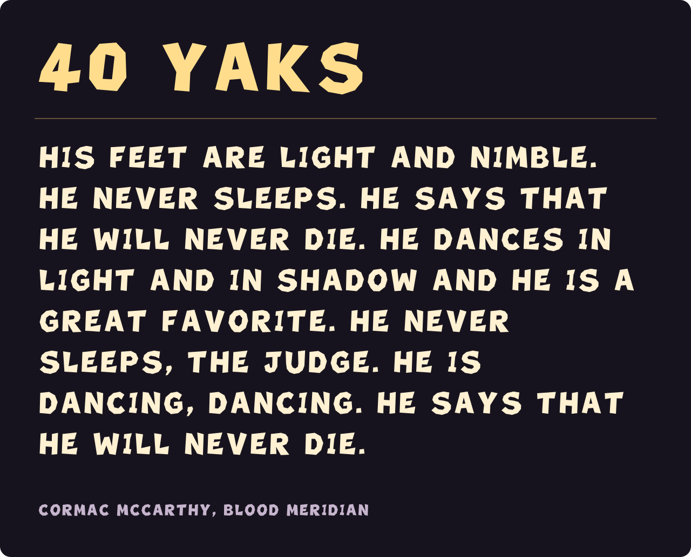

# Yak's Bad Fur Day

A chunky, capitals-only display font made from the polygon lettering used in **Lil Miner's Ruin**. It has broad strokes, uneven edges, splayed letterforms, and open counters. Available as installable TTF and WOFF2.



## Download

- **[YaksBadFurDay-Regular.ttf](fonts/ttf/YaksBadFurDay-Regular.ttf)** — desktop and native app font.
- **[YaksBadFurDay-Regular.woff2](fonts/woff2/YaksBadFurDay-Regular.woff2)** — compressed webfont.
- **[Latest release](https://github.com/andrew-dougie/yaks-bad-fur-day/releases/latest)** — font files, source, license, and examples.

On macOS, open the TTF in Font Book and select **Install**. On Windows, right-click it and select **Install**. The family appears as **Yak's Bad Fur Day**.

## Font details

| Detail | Included |
| --- | --- |
| Family | Yak's Bad Fur Day |
| PostScript name | `YaksBadFurDay-Regular` |
| Version | 1.000 |
| Weight | 900 |
| Glyphs | 76, including the missing-character glyph |
| Mapped code points | 110 |
| Coverage | Printable ASCII; selected typographic punctuation and math symbols |
| Kerning | 17 pairs |
| Formats | TTF and WOFF2 |

Lowercase input displays as uppercase shapes; there are no distinct lowercase drawings. The underlying text keeps its original spelling for copying, searching, and accessibility. Accented letters and unsupported scripts need a fallback font. See the [complete character map](fonts/characters.json).

The files contain monochrome vector outlines. The game's gold bevels, enamel colors, candle, jumbled placement, and animation are renderer effects, not part of the installable font. The editable [browser specimen](examples/index.html) includes both plain type and an optional layered CSS treatment.

## Install with a coding assistant

Copy this prompt into your coding assistant:

```text
Install Yak's Bad Fur Day in this project using its existing framework and typography conventions.

Download and bundle the appropriate font from release v1.000:
- Native/desktop TTF: https://github.com/andrew-dougie/yaks-bad-fur-day/releases/download/v1.000/YaksBadFurDay-Regular.ttf
- Web WOFF2: https://github.com/andrew-dougie/yaks-bad-fur-day/releases/download/v1.000/YaksBadFurDay-Regular.woff2
- License: https://raw.githubusercontent.com/andrew-dougie/yaks-bad-fur-day/v1.000/OFL.txt

Register the family as "Yak's Bad Fur Day", normal style, weight 900. Use WOFF2 for web projects and TTF for native apps. For iOS, add YaksBadFurDay-Regular.ttf to UIAppFonts and use PostScript name YaksBadFurDay-Regular. Include OFL.txt with the font assets.

Use this capitals-only display font for short headings rather than body copy. Lowercase characters already map to uppercase outlines; keep the original source text for accessibility. Add fallback fonts for unsupported characters. Do not assume the font contains the game's color or 3D effects.

Add a reusable font definition and a preview. Verify that the bundled font loads and renders letters, numbers, punctuation, and lowercase input correctly. Explain the changed files and how to apply the font.
```

## Web usage

```css
@font-face {
  font-family: "Yak's Bad Fur Day";
  src: url("YaksBadFurDay-Regular.woff2") format("woff2");
  font-weight: 900;
  font-style: normal;
  font-display: swap;
}

.title {
  font-family: "Yak's Bad Fur Day", sans-serif;
  font-weight: 900;
  font-size: 3rem;
  line-height: 1.3;
}
```

Open `examples/index.html` after cloning, or run `python3 -m http.server` from the repo and open `/examples/`.

## iOS usage

Add the TTF to your target's resources and list its filename under `UIAppFonts` in Info.plist:

```swift
label.font = UIFont(name: "YaksBadFurDay-Regular", size: 32)
label.text = "His feet are light and nimble."
```

## Build and verify

```sh
python3 -m venv .venv
source .venv/bin/activate
pip install -r requirements.txt
python tools/build-font.py
python tools/render-specimen.py
python tools/verify-font.py
```

The builder reads `sources/game-glyphs.json`, adds punctuation, constructs TrueType outlines, assigns character mappings and metrics, and exports both formats. Fixed timestamps and pinned dependencies make builds reproducible. The README specimen contains paths from the actual packaged font, so GitHub does not need to load a webfont.

See [source provenance](sources/PROVENANCE.md) for the game revision and the distinction between the glyphs and the renderer effects. This font is not extracted from Conker's Bad Fur Day.

## License

Copyright © 2026 Andrew White. Font software is licensed under the **[SIL Open Font License 1.1](OFL.txt)**. Personal and commercial use, embedding, modification, and redistribution are permitted under that license. No Reserved Font Names are declared.
