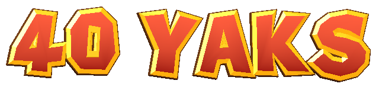

# Exact 3D lettering cookbook

This recipe preserves the enamel lettering geometry, materials, and layout used in Lil Miner’s Ruin. The [standalone source](../examples/three/lettering.js) includes both the generic heading builder and the complete original title fixture, including its candle and floating animation. [Source revisions and extraction changes](../examples/three/SOURCE.md) are pinned so future projects can reproduce this version.

**Use Three.js 0.180.0 and the supplied polygon coordinates for an exact mesh match.** Extruding a TTF, using CSS strokes, replacing Phong with a metallic/roughness material, or changing the lights gives a different result. Matching meshes does not alone guarantee identical screenshots: camera, framebuffer size, animation time, environment, postprocessing, and GPU rasterization also matter.



## 1. Run or copy the reference

From the repository root:

```sh
npm ci
npm run build:example
python3 -m http.server 8000
```

Open `http://localhost:8000/examples/three/`. The example is a static heading with the bright coral title face palette and heading gold rim. It has no dependency on the game or its engine. The build bundles the JSON contours; no remote font or texture is needed at runtime.

```js
import * as THREE from 'three';
import {createSculptedHeading, facePalettes} from './examples/three/lettering.js';
import {createStudio, frameHeading} from './examples/three/studio.js';

const {renderer, scene} = createStudio(document.querySelector('canvas'));
const text = createSculptedHeading('40 YAKS', 8, {
  facePalette: facePalettes.title
});
text.rotation.set(-.045, .10, 0); // radians, Three's default XYZ Euler order
scene.add(text);
const camera = frameHeading(text, renderer, 640);
renderer.render(scene, camera);
```

For the exact original title fixture, construct `new TitleLogo(scene)` from the same module. It provides the title-specific materials, three authored rows, procedural candle, and `update(dt, visible, reducedMotion, camera, region, idleAmount)`. Keep its root directly under the scene. Call `update` once per frame before rendering; `dt` is seconds. A normalized viewport `region` has `{x,y,width,height}`, with origin at the top left. Omit camera/region to use its authored world position. It is a reference fixture with the original title words, not a general text-layout API.

## 2. Contours and coordinate system

Read `sources/game-glyphs.json`. Each glyph has `p` (outer polygon), optional `holes`, optional `extra` (disconnected outer polygons, such as the exclamation point's dot), and `w` (authored advance). Close every path and preserve point order. Y points up and the visible face points toward positive Z.

**Do not normalize each glyph to its own bounds.** These polygons share a nominal one-unit capital height but intentionally overshoot it. Do not replace `w` with bounding-box width, apply font kerning, or use the TTF's translated/scaled coordinates. The fixed baseline and overshoots contribute to the irregular appearance. The supplied capital `I` includes the corrected full top crossbar; `1` is a separate contour.

The renderer supports the 43 authored glyphs plus spaces. `supportsSculptedHeading(text)` checks coverage; lowercase input is uppercased. Generated font-only punctuation is not included in the mesh recipe.

## 3. Mesh stack, bevels, and counter lining

Every outer polygon gets three **closed extrusions**, not a flat face decal. For all extrusions:

```js
new THREE.ExtrudeGeometry(shape, {
  depth, curveSegments: 1, steps: 1,
  bevelEnabled: true, bevelSegments: 1,
  bevelSize, bevelThickness
});
```

Leave `bevelOffset` at its default `0`. More bevel segments would smooth away the authored faceted edge. All translations below happen to geometry before it is added to a letter pivot.

| Mesh | Depth | Bevel size | Bevel thickness | Translate XYZ |
| --- | ---: | ---: | ---: | --- |
| Brown body | .25 | .11 | .045 | `[-w/2, 0, -.25]` |
| Gold rim | .028 | .09 | .036 | `[-w/2, 0, .012]` |
| Colored enamel | .01 | .003 | .005 | `[-w/2, 0, .083]` |
| Gold counter lining | .25 | .003 | .003 | `[-w/2, 0, -.15]` |

The title fixture's apostrophe alone reduces body bevel size to `.045` and rim bevel size to `.027`. Generic headings retain `.11` and `.09` for all characters, including apostrophes.

For **each hole**, also make a separate gold collar. Let `C` be the arithmetic mean of its polygon vertices (not the area centroid). Its outer polygon is `C + (P-C)*1.09`; its inner hole is `C + (P-C)*.65`. Extrude and translate with the lining row above. This supplies the visible inner lip and deep gold wall; ordinary outer bevels alone do not reproduce it.

Meshes set `castShadow=true`, leave `receiveShadow=false`, and use opaque, front-sided materials with default depth testing/writing. No polygon offset is applied. Sharing materials between letters is intentional.

## 4. Materials and color management

Use `MeshPhongMaterial` for the body and gold, with `flatShading=true`. Use `MeshBasicMaterial({color:0xffffff, vertexColors:true})` for the unlit enamel. Do not light the face gradient a second time.

| Setting | Brown body, both presets | Heading gold | Title gold |
| --- | --- | --- | --- |
| Base | `#71401B` | `#FFC51C` | `#FFD51A` |
| Emissive | `#301505` | `#D48200` | `#FFB900` |
| Emissive intensity | .35 | .55 | .85 |
| Specular | Three default `#111111` | `#FFEF88` | `#FFFAC2` |
| Shininess | 20 | 65 | 65 |
| Fog | true | true | false |

Heading enamel uses default `fog=true`; title enamel has `fog=false`. The title's brown body still receives fog. Studio bakes have no fog, so this distinction only affects scene integration.

Face palettes, listed **bottom → top**:

| Use | Bottom | Top |
| --- | --- | --- |
| Default heading / red result text | `#891D19` | `#FF7653` |
| Bright title coral | `#A51D13` | `#FF5D3D` |
| Positive feedback | `#176B3D` | `#91EF72` |
| Negative feedback / blue high-score heading | `#183B97` | `#70BFFF` |

For each enamel geometry vertex, before letter/world transforms:

```js
const t = THREE.MathUtils.clamp((y - low) / (high - low), 0, 1);
const color = new THREE.Color(bottomHex)
  .lerp(new THREE.Color(topHex), Math.pow(t, .65));
```

Write `color.r/g/b` into a `Float32BufferAttribute` named `color`. Use `[low,high]=[0,1]` except the generic comma uses `[-.19,.33]`. It is **not** a gradient normalized to each glyph's actual bounding box. Three's enabled color management converts hex sRGB colors into linear working values before interpolation. Output uses `SRGBColorSpace`, `NoToneMapping`, exposure `1`. Do not manually gamma-correct the same values again.

There are no random glints on heading letters. The cream glint material in the original title is used by the candle flame core.

## 5. Exact letter arrangement

### Generic headings

Start `cursor=0`, `index=0`. A space adds `.38` to cursor and does not increment index. For each visible glyph:

```js
pivot.position.set(cursor + w/2, Math.sin(index*1.8)*.025, Math.sin(index*2)*.012);
pivot.rotation.z = Math.sin(index*2.1)*.065;
cursor += w + .20;
index++;
```

After assembling the line, update world matrices and compute `Box3.setFromObject(root)`, including bevels and rotations. Subtract its XYZ center from every child pivot. Uniformly scale the root by `requestedWidth / Math.max(.01, box.max.x-box.min.x)`. There is no per-frame letter jitter in headings.

### Original title fixture

Each row uses `.075` tracking and a per-row index. Letter position is `[cursor+advance/2, bounce[i], sin(i*2)*.016]`; Z rotation is the authored angle below. Advance is `w`, except the candle uses `.80`.

| Row | Width | Baseline | X offset | Z angles | Y bounces |
| --- | ---: | ---: | ---: | --- | --- |
| LIL | 1.08 | 1.16 | -.69 | `[-.19,.03,.14]` | `[0,.06,-.02]` |
| MINER'S | 3.20 | .47 | 0 | `[-.13,.06,-.06,.06,-.09,-.13,.12]` | `[0,.03,.04,.01,.03,.26,.02]` |
| RUIN | 3.02 | -.55 | .04 | `[-.17,-.04,.03,.13]` | `[.03,-.035,.01,.06]` |

Uniformly scale each completed row by `width / boundsWidth`, then set its position to `[-boundsCenter.x*scale+xOffset, baseline, 0]`. Only X is centered. Root defaults: position `[.22,4.61,1.08]`, rotation `[-.02,.23,-.055]`, scale `.88`.

`floating-scene-title.js` contains the exact two-pass perspective fitting, arrival and exit. Idle root bob is `sin(t*1.4)*.025`, yaw is `sin(t*.75)*.065`, and roll is `sin(t)*.010`. Letter Z rotation adds `sin(t*1.1+globalIndex*.7)*.007`, letter Y rotation is `sin(t*.8+globalIndex*.6)*.012`. Reduced motion freezes time at zero, including these indexed offsets. Flame XY scale is `[1+sin(t*6)*.035, 1+sin(t*4.3)*.055]`. Copy the implementation rather than accumulating transforms each frame. The optional `opening(pose)` consumes externally supplied cinematic choreography; reproducing a whole cutscene additionally requires its timeline, not just this font recipe.

### Candle substitute

The candle is a procedural prop, **not** the font's I. `TitleLogo.addCandle` includes the complete cylinder/sphere/lathe geometry, all segment counts, placements, wax drips, wick and flame. Its local group scale is `1.12`. Wax gradient is `#8E291D → #E96B4C`, with `.35` brightness on the cap/drips. Brass is Phong `#FFDF83`, emissive `#956015` at `.45`, specular `#FFF4C2`, shininess `45`; iron is `#403A30`. The flame shell is unlit `#FFC332` and core `#FFF4C2`. These materials disable fog. The example preserves every construction value in source; ordinary heading text keeps the letter I.

## 6. Lighting, cameras, and rendering

### Transparent heading bake

The supplied `studio.js` uses:

- Renderer: `alpha=true`, `antialias=false`, `preserveDrawingBuffer=true`, pixel ratio `1`, transparent black clear, sRGB output. Shadows disabled.
- Hemisphere: sky `#FFF4D3`, ground `#301528`, intensity `2`.
- Directional: `#FFEDC4`, intensity `2.2`, position `[-3,5,8]`, target origin.
- Orthographic camera at `[0,0,8]`, near `.1`, far `20`, default orientation toward negative Z.
- Center the assembled, rotated group in XYZ. Let its bounds size be `S`. Output width `640`, height `ceil(640*(S.y+.24)/(S.x+.24))`. Half-width is `(S.x+.24)/2`; half-height is `halfWidth*height/640`.

The blue two-line high-score asset uses `NEW HIGH` width `8` at Y `.93`, rotation `[-.045,.10,.14]`; `SCORE!` width `6.7` at Y `-.93`, rotation `[-.045,.10,-.035]`. Both use the negative palette. Center/frame the combined group, not each line separately after placement.

### Live scene title

This is a different lighting environment from the transparent asset bake:

| Light | Color | Intensity | Position |
| --- | --- | ---: | --- |
| Hemisphere | sky `#B5A5D2`, ground `#463341` | 1.35 | default |
| Key directional | `#FFC27E` | 2.1 | `[-3,7,6]` |
| Rim directional | `#9A78EF` | 1.8 | `[3,4,-6]` |
| Point fill | `#779BAF` | 15 | `[3,4,4]` |

Directional targets are the origin. Point fill distance `14`, decay `2`. Background is `#171021`, exponential fog `#20172E` at `.065`. Key shadows use PCF, 1024² map, bias `-.002`, orthographic shadow bounds left/right `-9/9`, bottom/top `-7/8`, near/far `.5/24`. A constrained host render budget may reduce shadow size to 512². The camera's resized vertical FOV is `47°`, near `.1`, far `65`; camera placement and title viewport region depend on device layout and scene state. Match those too when comparing a particular device screenshot. The constructor's initial `38°` is superseded on resize.

## 7. Pixel finish and popup atlas

A bevel can be geometrically correct and still look too smooth if rendered at full device resolution.

The live scene uses pixel ratio `1`, no antialiasing, and nearest filtering on its scene render target. With no host budget override, internal height is `min(420,max(270,round(CSSHeight*.7)))`, width is `round(internalHeight*CSSWidth/CSSHeight)`. A host budget can further lower this. Do not multiply by device pixel ratio.

The postprocess samples that target, applies a vignette with `p=uv-.5`, `vig=1-smoothstep(.22,.72,length(p*vec2(.93,1)))`, and multiplies linear RGB by `mix(.56,1,vig)`. Add linear RGB `vec3(.8,.21,.06)*flash` (zero for ordinary title viewing), convert output to sRGB, then quantize:

```glsl
float d = mod(gl_FragCoord.x + mod(gl_FragCoord.y, 2.)*2., 4.)/4. - .375;
srgb = floor(max(srgb, vec3(0.))*48. + d*.22)/48.;
```

The standalone transparent studio preview intentionally omits the scene vignette/quantization. Use it to verify geometry and materials; apply the scene pipeline for a live-game match.

Hit-feedback glyphs are baked once and drawn from an atlas rather than rebuilt as meshes every hit. Exact atlas settings:

- Characters `ABCDEFGHIJKLMNOPQRSTUVWXYZ0123456789+-·!,'`; eight columns, 160×160 cells, separate positive/negative palettes.
- Same studio lights and sRGB output, but **antialias=true** for this source atlas.
- Ortho bounds `[-.8,.8]` on both axes, near/far `.1/20`, camera `[0,0,8]`.
- Build one glyph at width `1`, rotate `[-.045,.10,0]`, cancel the heading's normalization with `scale *= 1/scale.x`, then measure bounds. Apply uniform scale `.95` and center its final XYZ bounds. Shift comma down `.40`, apostrophe up `.37`.
- Crop width `min(160,ceil(unscaledRotatedBoundsWidth*.95/1.6*160)+4)`, centered horizontally. Advance is crop width + `3`; nominal height `160`, space `45`.
- Runtime layout cycles Z angles `[-.13,.10,-.07,.12,-.10,.06]`, Y lifts `[0,-.06,.025,-.025,.045,-.035]*height`, and scales `[1.02,.95,1.05,.97,1,.98]`. This is fixed letter splay, not random animation.
- Runtime artwork density is `min(1,pixelBufferSize(viewportHeight,viewportHeight).height/viewportHeight)`. Downsample artwork dimensions with `floor(CSSDimension*density)`, clamped to `[1,4096]`, then display using nearest-neighbor sampling. The high-resolution atlas alone is not the final pixel effect.

## 8. Copy/paste exact 3D installation prompt

```text
Install the exact enamel extrusion recipe from https://github.com/andrew-dougie/40-yaks in this project. Read docs/3d-cookbook.md and examples/three/SOURCE.md first. Pin the repository commit you use and Three.js 0.180.0.

Bundle sources/game-glyphs.json and examples/three/lettering.js plus floating-scene-title.js. Keep OFL.txt. For generic strings use createSculptedHeading; choose the heading, bright title, positive, or negative face palette explicitly. For the original title material/layout/animation reference use TitleLogo. Do not substitute TTF-derived outlines or normalize glyphs independently. Preserve all bevel depths, translations, gold counter collars, material properties, linear-space gradients, fixed letter transforms and post-layout bounds centering. The title and heading gold presets differ; do not silently combine them.

Match the camera, lighting and pixel pipeline to the intended output: studio.js is the exact transparent heading bake; section 6 documents the live-scene lights and section 7 its pixel finish. Copying geometry without those settings is not a pixel-identical scene replica. The CSS example is only an approximation and is not a replacement for this recipe.

Integrate with the project's renderer and lifecycle, keeping source text accessible and honoring reduced motion. Dispose shared geometries/materials once when their owner is destroyed. Validate counters in B/O/8, the full top bar of I versus 1, apostrophe/comma placement, all palette choices and clipping at actual display size. If porting to another engine, preserve geometry, linear color interpolation and Phong lighting before claiming parity; compare reference screenshots at identical resolution and camera/time.
```

## Verification

`npm run verify:3d -- /path/to/lil-miners-ruin` compares every authored single glyph and representative multi-letter headings against the pinned original builder, including vertex positions, normals, colors, triangle indices, material settings, transforms, and the complete title/candle across visible/hidden and reduced-motion updates. It requires the source checkout and its engine dependency. A changed upstream revision should be reviewed before updating this recipe. Render comparisons must use the same Three.js version and graphics backend; different GPUs can have small rasterization differences even with identical meshes.

Validated on September 16, 2026: **276 exact geometry/material/transform comparisons passed** against the source revisions above. The `40 YAKS` example also produced a byte-identical transparent PNG from the original and extracted builders in the same Chromium/SwiftShader renderer; that image is shown above. The standalone example loaded with no JavaScript errors. This is a controlled reference comparison, not a guarantee of byte-identical rasterization across graphics backends.
